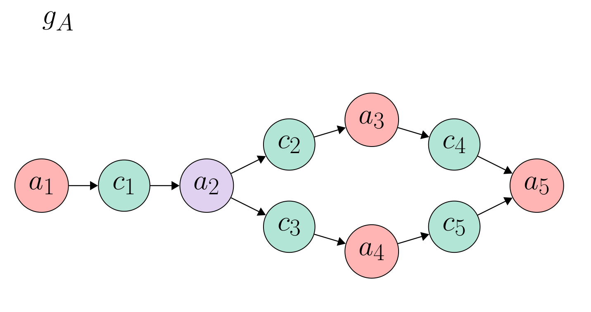
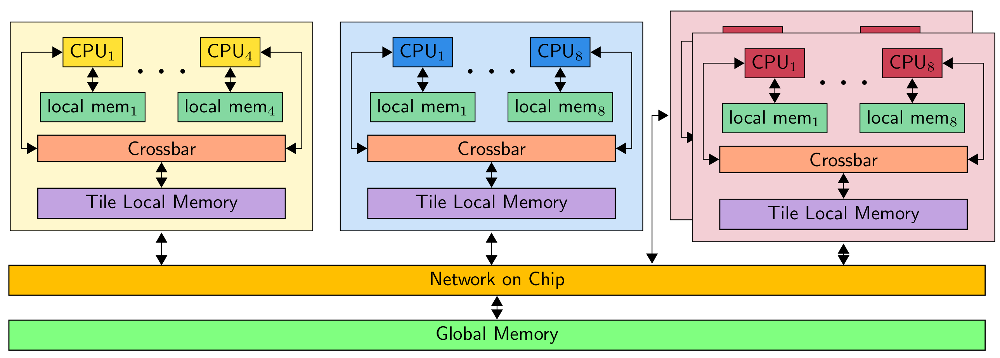

# Multi-tile Architecture Simulator

This repository presents the implementation of a system level simulator.
Here, the simulation of an application to a many core architecture is performed.
The simulator takes as inputs the target architecture, the application and the scheduler.


## Application
The application is defined as a dataflow graph. A dataflow graph consists of a collection of actors that are connected via communication channels.
In the context of this repository, the communication channels are implemented as First-In-First-Out (FIFO) buffers.
Actors model the functionality of the application under observation.
E.g., the following figure presents the dataflow of an implementation of the sobel algorithm.



To define a application graph, you can declare an actor using the **Actor** class as:

```c
Actor a1 = new Actor("a1");                                                                                   
a1.setExecutionTime(10000);                                                                                   
a1.setInputs(0);                                                                                              
a1.setOutputs(1);  
```

It is required to specify the execution time on a given actor used during scheduling and simulation. Also, the number of input and output ports are required. In the example, **a1** has no inputs and has one output port.

```c
public Fifo(String name, int tokens, int capacity, int tokenSize,
            Memory mapping,int consRate, int prodRate, Actor src, 
            Actor dst)
```
## Target Architecture



## Scheduler
