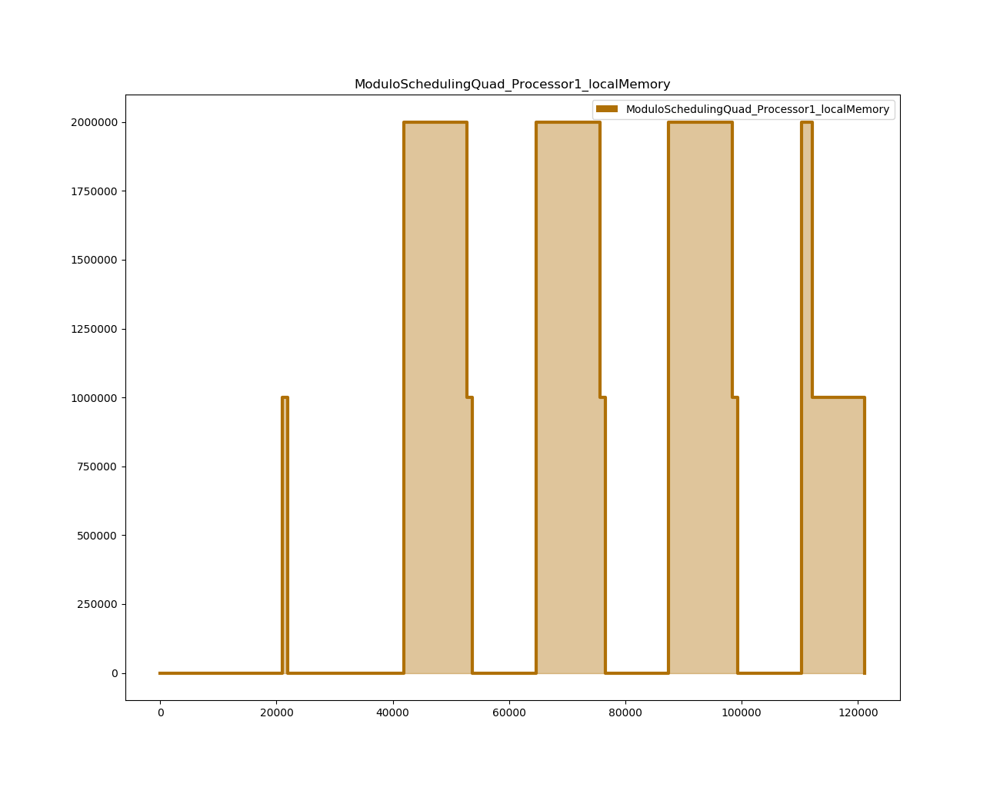

# Modulo Scheduling Simulator for Multicore Architectures

This repository presents the implementation of a system level simulator.
Here, the simulation of an application to a many core architecture is performed.
The simulator takes as inputs the target architecture, the application and the scheduler.


## Application
The application is defined as a dataflow graph. A dataflow graph consists of a collection of actors that are connected via communication channels.
In the context of this repository, the communication channels are implemented as First-In-First-Out (FIFO) buffers.
Actors model the functionality of the application under observation.
E.g., the following figure presents the dataflow of an implementation of the sobel algorithm.


To define a application graph, you can declare an actor using the **Actor** class as:

```c
Actor a1 = new Actor("a1");                                                                                   
a1.setExecutionTime(10000);                                                                                   
a1.setInputs(0);                                                                                              
a1.setOutputs(1);  
```

It is required to specify the execution time of a given actor used during scheduling and simulation. Also, the number of input and output ports are required. In the example, **a1** has no inputs and has one output port.

The definition of communication channels as FIFOs can be done using the FIFO class:
```c
public Fifo(String name, int tokens, int capacity, int tokenSize,
            Memory mapping,int consRate, int prodRate, Actor src, 
            Actor dst)
Fifo c1 = new Fifo("c1",0,1,1000000,memory1,1,1,a1,a2); 
```

The relation between FIFOs and Actors is specified by the actor's methods **setOutputFifos** and **setInputFifos**.
E.g., in the following listing, the actor **a1** has one output connected to FIFO **c1**, whereas the actor **a2** has one input connected to the FIFO **c1**. Actors **a1** and **a2** communicate via channel **c1**.

```c
Vector<Fifo> v1 = new Vector<Fifo>();
v1.addElement(c1);
a1.setOutputFifos(v1);

Vector<Fifo> v2 = new Vector<Fifo>();
v2.addElement(new Fifo(c1));
a2.setInputFifos(v2);
```

You must use the class **Application** to define an application as follows:

```c
Application sampleApplication = new Application();
sampleApplication.setActorsFromList(actors);
sampleApplication.setFifos(fifoMap);
```

Here, it is required to pass the actors and the FIFOS that composed the application after constructing the application itself.


## Target Architecture

The second part of the input specification is the definition of the target architecture.
In the context of this repository, we consider two target architectures 1) Symmetric Quad-Core Architecture and 2) Multi-tile Many-cores architecture. 
E.g., the following figure presents the Symmetric Quad-Core target architecture.
Each processor has a local scratchpad memory, and its turn each processor is connected to a bus which also connects a global memory. Here, the global memory is used to communicate the different processors.

For creating a symmetric multicore architecture, you must use the following constructor:

```c
public Architecture(String name, String nameTile, int nProcPerTile, double BWCrossbars, int channelsCrossbar)

Architecture singleCoreArchitecture = new Architecture("architecture","Tile1", 4, 1.0, 2);
```

The previous listing declares a architecture name "architecure" with a tile named "Tile1", with four processors with a crossbar interconnect with two channels at 1.0 Gbps.
The crossbar also connects the four cores to the global memory as in the next figure.


### Processor 

When declaring an architecture and specifying the number of processors, the corresponding processors are declared in the constructor of the tile  as:

```c
this.numberProcessors = numberProcessors;
this.processors = new HashMap<>();
//System.out.println("Here!");
for(int i=0; i<this.numberProcessors;i++){
  Processor processor = new Processor(this.name+"_Processor"+i);
  processor.setOwnerTile(this);
  processors.put(processor.getId(),processor);
}
```

When declaring a processor, the name of the processor is required in the constructor, however, during the construction of a processor the scratchpad local memory is created and connected to the processor.

```c
public Processor(String name) {
    this.setName(name);
    this.setId(ArchitectureManagement.getProcessorId());
    localMemory = new LocalMemory(this.name+"_localMemory");
    // connecting local memory to processor
    this.localMemory.setEmbeddedToProcessor(this);
  }
```

### Memory 
An important element of the architecture is the memory. There might be three types of memories:

```c
public static enum MEMORY_TYPE {
  LOCAL_MEM,
  TILE_LOCAL_MEM,
  GLOBAL_MEM
}
```

The scratchpad memory (LOCAL_MEM) has been already introduced as a member of a processor. Further details about the other memories will be given in next sections.
An important feature of this simulator is the flexibility of simulate without memory constraints (assuming memory boundless just for simulation purposes). If a memory size constraint is violated the memory will notify this situation and memory relocation strategies might be also implemented. During the construction, all memories are set capacity to **Double.POSITIVE_INFINITY** however the capacity can be changed via the method **setCapacity(double capacity)**.

```c
  public Memory(String name){
    this.name = name;
    this.id       = ArchitectureManagement.getMemoryId();
    this.resetMemoryUtilization();
    this.capacity = Double.POSITIVE_INFINITY;
  }
```


Also, the memory tracks the number of bytes stored in memory at any simulation time **private Map<Double,Double> memoryUtilization**. The next figure, shows the output of a memory trace during simulation.

Memory might be read and written along simulation. The memory capacity must be specified in terms of bytes.

### Crossbar

The crossbar is the element used to connect the processors in a tile. The crossbar is defined as follows:
```c
public Crossbar(String name, double bandwidth, int numberofParallelChannels)
```

The crossbar tracks the transfers of data of any processor to the tile local memory placed in each tile.
```c
private List<LinkedList<Transfer>> scheduledActions;
private Map<Actor,List<Transfer>> scheduledReadTransfers;
private Map<Actor,List<Transfer>> scheduledWriteTransfers;
```
A transfer can be categorized as **READ** or **WRITE**.
```c
public static enum TRANSFER_TYPE {
          READ,
          WRITE
  }
```
The elements stored in a TRANSFER are:
```c
public class Transfer {
  private double start_time;
  private double due_time;
  // in a transfer, an actor and a Fifo are involved
  private Actor actor;
  private Fifo fifo;
  // depending on the type of the operation: {READ, WRITE}
  private TRANSFER_TYPE type;
```
Here, the elements involved are an actor that reads or writes to a given FIFO. The **start_time** of the Transfer must be specified. The length of the transfer is calculated using the number of tokens produced/consumed by the actor and the bandwidth of the crossbar used to perform the transfer.

### Tile
The class that glues of the previous presented elements is the class Tile.
A tile is composed of a collection of processors, a crossbar and a tile local memory.
```c
public class Tile{
  private int id;
  private String name;
  private int numberProcessors;
  // the key is the id
  private HashMap<Integer,Processor> processors;
  private Crossbar crossbar;
  private TileLocalMemory tileLocalMemory;
...
```
The declarion of a tile is as follows:
```c
// creaate one tile in the architecture
Tile t1 = new Tile("Tile1",4,1.0,2);
```
The previous declared a tile named "Tile1" with 4 processors and a crossbar with 2 channels at 1.0 Gbps.
### Multi-tile Architecture
The class architecture offers the flexibility to declare multi-tile architectures.
The trivial case is single tile architecture as already presented. However, non symmetric architectures might also be able to define as in the following figure.


### Network-on-Chip

Work in Progress

## Modulo Scheduling

### Algorithm

### Memory Relocation Strategy
